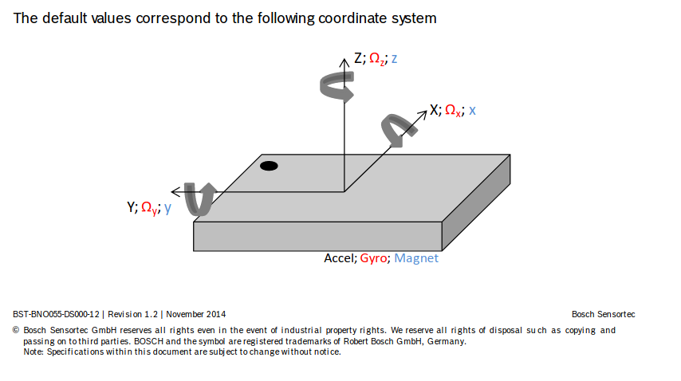
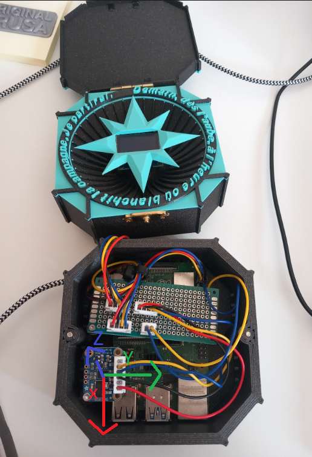
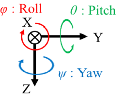
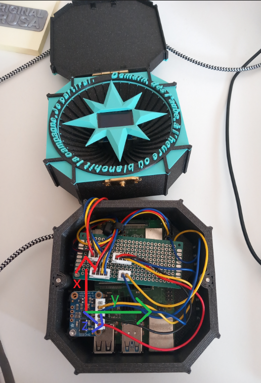

# imu_filter_cpp
A repo to implement non-linear filtering of imu data received via websocket, serialized with protobuffer, for state estimation.

## Cordinate Systems

Datasheet for sensor is [here](https://cdn-shop.adafruit.com/datasheets/BST_BNO055_DS000_12.pdf). We can see our sensor's default coordinate system in the PDF.   


Note we have mounted the sensor as per below, yielding this system:    


Our filter model has the below coordinate system:  
  
Fig 1, Saito, A., Kizawa, S., Kobayashi, Y. et al. Pose estimation by extended Kalman filter using noise covariance matrices based on sensor output. Robomech J 7, 36 (2020). https://doi.org/10.1186/s40648-020-00185-y

So we want to rotate our sensor's coordinate system to the below to match our filter model. This entails flipping the sign on the z and x axis. 


We can do this with a matrix like the below:
```
-1  0  0
 0  1  0
 0  0 -1
```